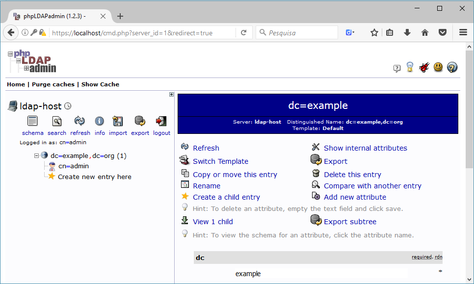

# docker-openldap
A simple docker-based OpenLDAP client server tutorial

## Requirements

- Docker

## Server

- OpenLDAP is based on docker image from [osixia/openldap:latest](https://hub.docker.com/r/osixia/openldap/).
- phpLDAPadmin is bases on docker image from [osixia/phpldapadmin:latest](https://hub.docker.com/r/osixia/phpldapadmin/).

Usage: ```server.sh start | stop | restart```

The start option runs the OpenLDAP + phpLDAPadmin docker containers.
The stop options stops the containers and removes them.

After starting the server container, you can access your favorite web browser and hit the URL `https://localhost` for using the phpLDAPadmin web interface:


Use the following credentials to access the phpLDAPadmin interface: 

- user: `cn=admin,dc=example,dc=org`
- password: `admin`


You can then manage the LDAP directories and perform the most common actions from this web interface:



## Client

- OpenLDAP is based on docker image from [osixia/openldap:latest](https://hub.docker.com/r/osixia/openldap/).

Usage: ```client.sh start | stop | restart```

The start option runs the OpenLDAP container and performs an ldap search from the command-line.
The stop options stops the container and removes them.

## Docker-compose

Alternatively, a docker-compose.yml file is provided and can be used to start/stop the containers with:

```bash
$ docker-compose up -d
```

Starts the containers. To perform the ldap search test on the client, issue the following command:

```bash
$ docker exec -it ldap-client ldapsearch -D "cn=admin,dc=example,dc=org" -h ldap-service -w admin -b "dc=example,dc=org" -s sub "(objectclass=*)"
```

The results should be the following:

```
# extended LDIF
#
# LDAPv3
# base <dc=example,dc=org> with scope subtree
# filter: (objectclass=*)
# requesting: ALL
#

# example.org
dn: dc=example,dc=org
objectClass: top
objectClass: dcObject
objectClass: organization
o: Example Inc.
dc: example

# admin, example.org
dn: cn=admin,dc=example,dc=org
objectClass: simpleSecurityObject
objectClass: organizationalRole
cn: admin
description: LDAP administrator
userPassword:: e1NTSEF9UzVZZGg3ZVBXWTBCbHUyMC9WV2NmRERudlY5SC9VQ04=

# search result
search: 2
result: 0 Success

# numResponses: 3
# numEntries: 2
```

```bash
$ docker-compose down
```
Stops the containers and removes them.